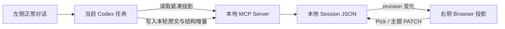

# Vibe Canvas


简体中文 | [English](README_EN.md)

> 让 Codex 对话在右侧实时长成一张可筛选的思考画板。


## 简介

Vibe Canvas 是一个本地优先的 Codex 插件。你继续在左侧正常和 Codex 对话，右侧 Browser 会自动展示三层内容：

- 逐字保留的对话原文
- AI 归纳后的结构化理解
- 随对话持续生长的思维导图

它不是一个需要再次输入、再次发送或手动保存的独立网站。HTML 页面只是 Codex 右侧的实时投影视图；输入、理解和推理仍然发生在当前 Codex 任务中。

适合用来做头脑风暴、方案推演、学习笔记、复盘、需求梳理，以及任何需要“边聊边看见结构”的思考过程。

## 功能特性

- **对话即输入**：左侧 Codex 是唯一文字入口，画板内没有第二套输入框。
- **原文可追溯**：每一轮用户输入逐字保留，不把 AI 改写冒充原文。
- **AI 自动 Pick**：新内容会被判断为 `picked`、`candidate` 或 `ignored`。
- **候选缓冲**：暂时无法判断的内容先等待后续语境，不急着进入结构。
- **人工最终决定**：每轮都有 Pick Checkbox；人工选择永久高于后续 AI 判断。
- **实时重组**：取消 Pick 后，对应内容立即退出结构和脑图，不会再次调用模型。
- **本地优先**：会话和主题偏好保存在当前 workspace 的 `.local/` 目录。
- **双主题**：亮蓝色默认主题与暖色主题可以即时切换并记住偏好。
- **增量同步**：每轮只读取紧凑投影并写入当前增量，避免反复回放全部对话。

## 截图

### Pick 已选与未选

左侧为绿色已选状态，右侧为灰色未选状态；取消后结构和脑图会同步更新。


## 环境要求

- Codex Desktop，且支持本地 Plugin、Skill、MCP Server 和右侧 Browser
- Node.js 20 或更高版本
- 可用的 `codex` CLI

当前版本在 macOS 上完成开发与验收。

## 安装

直接把 GitHub 仓库注册为 Codex Marketplace，再安装其中的插件：

```sh
codex plugin marketplace add prozacLaputa/vibe-canvas
codex plugin add vibe-canvas@vibe-canvas --json
```

确认安装状态：

```sh
codex plugin list --json
```

安装或升级后建议新建一个 Codex 任务，让 Skill 和 MCP 工具完成重新发现。

## 使用

在新的 Codex 任务中输入：

```text
使用 $vibe-canvas 打开一个思考画板
```

随后正常对话即可：

1. Codex 在右侧打开 Vibe Canvas。
2. 每轮回答前，当前对话会把本轮原文和结构增量同步到画板。
3. AI 自动选择明确有价值的内容，并把不确定内容放入候选缓冲。
4. 你可以在原文区点击 Pick，随时决定某轮是否进入结构与脑图。
5. 右上角 Switch 可切换蓝色与暖色主题。

画板激活范围只限当前 Codex 任务；普通任务不会被自动接管。

## 原理



核心由三部分组成：

1. **Skill 负责时机与约束**：显式打开后，每轮通过 `vibe_canvas_get_projection` 读取紧凑上下文，再用 `vibe_canvas_sync_turn` 写入当前增量。不会启动第二个 Codex 会话，也不会伪造用户消息。
2. **MCP Server 负责状态**：Node.js 进程同时提供 MCP 工具和仅监听 `127.0.0.1` 的本地 HTTP API，并把 session 持久化为 JSON。
3. **Browser 负责投影与筛选**：页面约每 900 ms 检查内部 revision，只在状态变化时重绘。Pick 和主题切换直接走本地 HTTP，不调用模型、不消耗额外 Token。

Token 主要来自每轮一次紧凑结构读取和一次小型增量写入；浏览器轮询、主题切换和人工 Pick 都是纯本地操作。

默认数据位置：

```text
<workspace>/.local/vibe-canvas-demo/sessions/<session-id>.json
<workspace>/.local/vibe-canvas-demo/preferences.json
```

## 快捷键

当前没有额外快捷键；使用 Codex 对话和画板中的 Pick / 主题控件即可。

## 开发

```sh
npm test
```

测试通过公开 MCP JSON-RPC 和本地 HTTP 投影 API 覆盖打开画板、增量同步、AI Pick、候选复判、人工覆盖、主题偏好和状态恢复。

## 更新日志

见 [CHANGELOG.md](CHANGELOG.md)。

## 许可证

[MIT](LICENSE) © 2026 prozacLaputa
