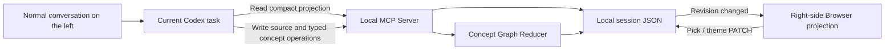

# Vibe Canvas


[简体中文](README.md) | English

> Let a normal Codex conversation grow into a live, filterable thinking canvas on the right.


## Overview

Vibe Canvas is a local-first Codex plugin. Keep talking to Codex normally on the left while the Browser panel on the right projects structured thought and lets each third-level claim reveal fourth-level source evidence on demand:

- Your exact source turns
- AI-structured understanding
- A mind map that evolves with the conversation
- Verbatim evidence that stays collapsed until you ask for it

It is not a separate website that asks you to type, submit, or save again. The HTML page is only a live projection inside Codex; input, understanding, and reasoning stay in the current Codex task.

It works well for brainstorming, planning, learning notes, retrospectives, requirement shaping, and any thought process that benefits from seeing structure emerge while you talk.

## Features

- **Conversation is the input**: Codex remains the only text entry surface.
- **Verbatim source**: Every user turn is preserved exactly instead of being replaced by an AI rewrite.
- **AI auto-Pick**: New turns are classified as `picked`, `candidate`, or `ignored`.
- **Candidate buffer**: Uncertain ideas wait for later context before entering the projection.
- **Manual authority**: Each turn has a Pick Checkbox, and a manual choice always overrides later AI decisions.
- **Instant regrouping**: Unpicking a turn removes its contribution from the structure and graph without another model call.
- **Local-first storage**: Sessions and theme preferences stay under the current workspace's `.local/` directory.
- **Two themes**: Switch between the bright blue default and a warm alternative, with persistent preference.
- **Incremental sync**: Each turn reads a compact projection and writes only the current delta instead of replaying the full transcript.
- **Cross-turn consolidation**: The same question reuses a stable Topic, while equivalent propositions become one Claim backed by evidence from multiple turns instead of an append-only list.
- **Cross-topic ideas**: One Claim can belong to a primary Topic and related Topics through typed relations without duplicating the text across branches.
- **Real disagreements survive**: Opposing claims stay separate and can be linked with `contradicts` instead of being erased as duplicates.
- **Bounded projection**: The default view stays within 25 nodes and keeps the 40 most recently active Claims available for matching; summaries and provenance context are bounded too.
- **Fourth-level source evidence**: A third-level Claim shows `Source N`; click it or press Enter/Space to reveal verbatim excerpts. Each excerpt must match its user turn exactly and cannot be invented by AI.

## Screenshots

### Picked and unpicked states

Green indicates picked; gray indicates unpicked. The structured view and mind map update immediately.


## Requirements

- Codex Desktop with local Plugin, Skill, MCP Server, and right-side Browser support
- Node.js 20 or newer
- The `codex` CLI available on your path

The current version was developed and verified on macOS.

## Install

Register this GitHub repository as a Codex Marketplace and install the plugin:

```sh
codex plugin marketplace add prozacLaputa/vibe-canvas
codex plugin add vibe-canvas@vibe-canvas --json
```

Verify the installation:

```sh
codex plugin list --json
```

After installing or upgrading, start a new Codex task so the Skill and MCP tools can be rediscovered.

## Usage

In a new Codex task, enter:

```text
Use $vibe-canvas to open a thinking canvas
```

Then keep chatting normally:

1. Codex opens Vibe Canvas on the right.
2. Before each response, the current task syncs the exact source turn and its structured delta.
3. AI selects clear signal and holds uncertain turns in a candidate buffer.
4. Use Pick in the source panel whenever you want to include or exclude a turn.
5. Use the header Switch to change between blue and warm themes.
6. Click a third-level mind-map claim to expand or collapse its fourth-level source excerpts.

The canvas is active only in the Codex task where you explicitly opened it.

## How it works



The implementation has three parts:

1. **The Skill owns timing and semantic judgment**: after explicit activation, each turn reads canonical Topics and recent Claims through `vibe_canvas_get_projection`, then decides whether the new expression should reuse, merge, link, or split concepts. It does not start a second Codex session or synthesize user messages.
2. **The MCP Server owns deterministic state**: a Node.js process exposes MCP tools plus a local HTTP API bound to `127.0.0.1`. Its reducer handles stable IDs, exact normalized deduplication, Pick provenance, cross-topic relations, bounded projection, and verifies that every `sourceQuote` is an exact span from the current user turn before persisting JSON.
3. **The Browser owns projection and filtering**: the page checks the internal revision about every 900 ms and redraws only when state changes. Pick, theme, and evidence expansion are local actions with no model call and no additional token cost.

Semantic paraphrases are judged by the current Codex model. The server only provides a deterministic fallback for questions or claims that become identical after normalization, so the project does not claim that every possible rewrite is merged with 100% accuracy. Consolidation is scoped to one Canvas session and does not automatically cross separate Codex tasks.

Token usage comes mainly from one compact projection read and one small delta write per turn. The view is capped at 25 nodes and matching context at 40 recent Claims. Codex receives only evidence counts plus the three latest source IDs, never repeated quote text. Exact excerpts are sent only to the local Browser, limited to the five most recent visible quotes; complete provenance remains in local JSON. Browser polling, theme switching, manual Pick, and evidence expansion are entirely local.

Default data locations:

```text
<workspace>/.local/vibe-canvas-demo/sessions/<session-id>.json
<workspace>/.local/vibe-canvas-demo/preferences.json
```

## Keyboard Shortcuts

Focus a third-level claim that shows `Source N`, then press Enter or Space to expand or collapse its fourth-level excerpts. Use the Codex conversation and the Pick/theme controls for everything else.

## Development

```sh
npm test
```

The 33-test behavior suite plus a Browser visual test cover canvas creation, incremental sync, AI Pick, candidate review, manual overrides, theme persistence, recovery, cross-turn deduplication, typed relations, exact-quote validation, default collapse, mouse and keyboard expansion, a 12-turn aggregation replay, and a 100-turn provenance bound.

## Changelog

See [CHANGELOG.md](CHANGELOG.md).

## License

[MIT](LICENSE) © 2026 prozacLaputa
