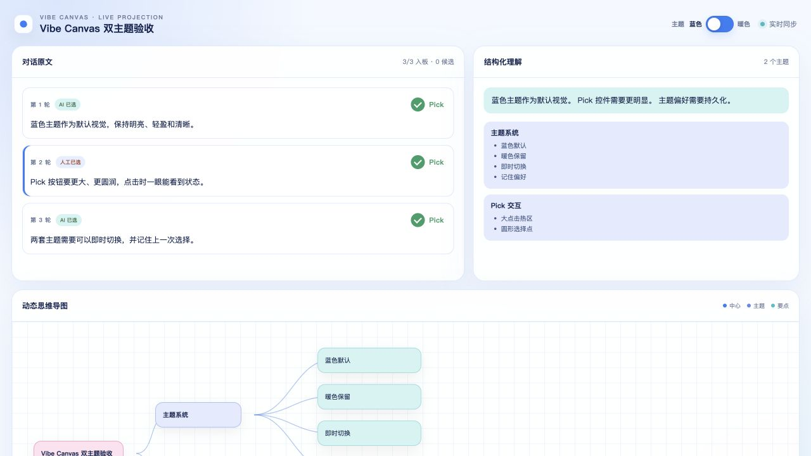
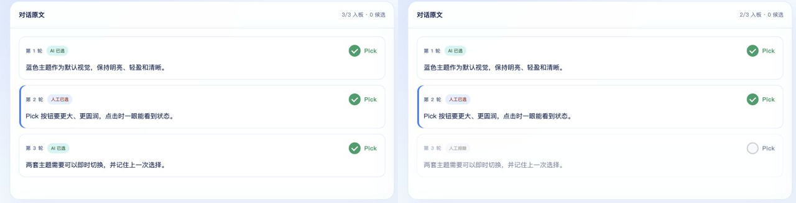
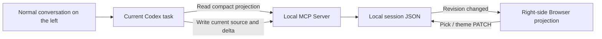

# Vibe Canvas


[简体中文](README.md) | English

> Let a normal Codex conversation grow into a live, filterable thinking canvas on the right.



## Overview

Vibe Canvas is a local-first Codex plugin. Keep talking to Codex normally on the left while the Browser panel on the right continuously projects three layers:

- Your exact source turns
- AI-structured understanding
- A mind map that evolves with the conversation

It is not a separate website that asks you to type, submit, or save again. The HTML page is only a live projection inside Codex; input, understanding, and reasoning stay in the current Codex task.

It works well for brainstorming, planning, learning notes, retrospectives, requirement shaping, and any thought process that benefits from seeing structure emerge while you talk.

## Features

- **Conversation is the input**: Codex remains the only text entry surface.
- **Verbatim source**: Every user turn is preserved exactly instead of being replaced by an AI rewrite.
- **AI auto-Pick**: New turns are classified as `picked`, `candidate`, or `ignored`.
- **Candidate buffer**: Uncertain ideas wait for later context before entering the projection.
- **Manual authority**: Each turn has a Pick Checkbox, and a manual choice always overrides later AI decisions.
- **Instant regrouping**: Unpicking a turn removes its contribution from the structure and graph without another model call.
- **Local-first storage**: Sessions and theme preferences stay under the current workspace's `.local/` directory.
- **Two themes**: Switch between the bright blue default and a warm alternative, with persistent preference.
- **Incremental sync**: Each turn reads a compact projection and writes only the current delta instead of replaying the full transcript.

## Screenshots

### Picked and unpicked states

Green indicates picked; gray indicates unpicked. The structured view and mind map update immediately.



## Requirements

- Codex Desktop with local Plugin, Skill, MCP Server, and right-side Browser support
- Node.js 20 or newer
- The `codex` CLI available on your path

The current version was developed and verified on macOS.

## Install

Register this GitHub repository as a Codex Marketplace and install the plugin:

```sh
codex plugin marketplace add prozacLaputa/vibe-canvas
codex plugin add vibe-canvas@vibe-canvas --json
```

Verify the installation:

```sh
codex plugin list --json
```

After installing or upgrading, start a new Codex task so the Skill and MCP tools can be rediscovered.

## Usage

In a new Codex task, enter:

```text
Use $vibe-canvas to open a thinking canvas
```

Then keep chatting normally:

1. Codex opens Vibe Canvas on the right.
2. Before each response, the current task syncs the exact source turn and its structured delta.
3. AI selects clear signal and holds uncertain turns in a candidate buffer.
4. Use Pick in the source panel whenever you want to include or exclude a turn.
5. Use the header Switch to change between blue and warm themes.

The canvas is active only in the Codex task where you explicitly opened it.

## How it works



The implementation has three parts:

1. **The Skill owns timing and constraints**: after explicit activation, each turn reads compact context through `vibe_canvas_get_projection` and writes the current delta through `vibe_canvas_sync_turn`. It does not start a second Codex session or synthesize user messages.
2. **The MCP Server owns state**: a Node.js process exposes MCP tools plus a local HTTP API bound to `127.0.0.1`, and persists each session as JSON.
3. **The Browser owns projection and filtering**: the page checks the internal revision about every 900 ms and redraws only when state changes. Pick and theme actions use local HTTP only, with no model call and no additional token cost.

Token usage comes mainly from one compact projection read and one small delta write per turn. Browser polling, theme switching, and manual Pick are entirely local.

Default data locations:

```text
<workspace>/.local/vibe-canvas-demo/sessions/<session-id>.json
<workspace>/.local/vibe-canvas-demo/preferences.json
```

## Keyboard Shortcuts

There are no extra shortcuts yet. Use the Codex conversation and the Pick/theme controls in the canvas.

## Development

```sh
npm test
```

The suite exercises the public MCP JSON-RPC and local HTTP projection APIs, including canvas creation, incremental sync, AI Pick, candidate review, manual overrides, theme persistence, and session recovery.

## Changelog

See [CHANGELOG.md](CHANGELOG.md).

## License

[MIT](LICENSE) © 2026 prozacLaputa
